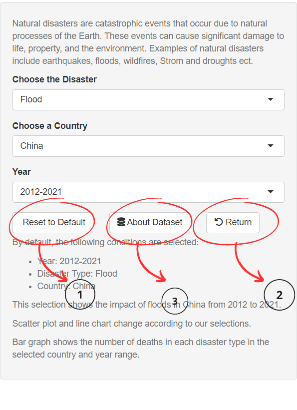

# Trends and Impacts of Natural Disasters from 1970 to 2021

When we consider the last half of the century, we had to face various natural disasters. These disasters have done significant damage to lives, properties, and the environment. As a result, human beings have to adapt to new lifestyles.

Then, I tried to create an interactive web page using Rshiny package to gain an understanding of how natural disasters have affected different countries.

## Data
To achieve that, I have used the following dataset.

Link to data :<a href="https://www.kaggle.com/datasets/brsdincer/all-natural-disasters-19002021-eosdis"> https://www.kaggle.com/datasets/brsdincer/all-natural-disasters-19002021-eosdis</a>

  

----------------------------------------------------------------------------------------------------------------------------------------------------------------------

 

 <ul>
   <li>  By default, the visualization displays flood damage data in China from 2012 to 2021. However, you have the flexibility to select any country, specify a range of years, and choose a different type of disaster for visualization.To return to the default settings at any time, simply click the 'Reset to Default' button.</li>
  <li>To gain more insight into the dataset, simply click on the 'About Dataset' button.</li>
  <li>To return to the beginning and reset your selections, just click the 'Return' button.</li>
</ul> 
